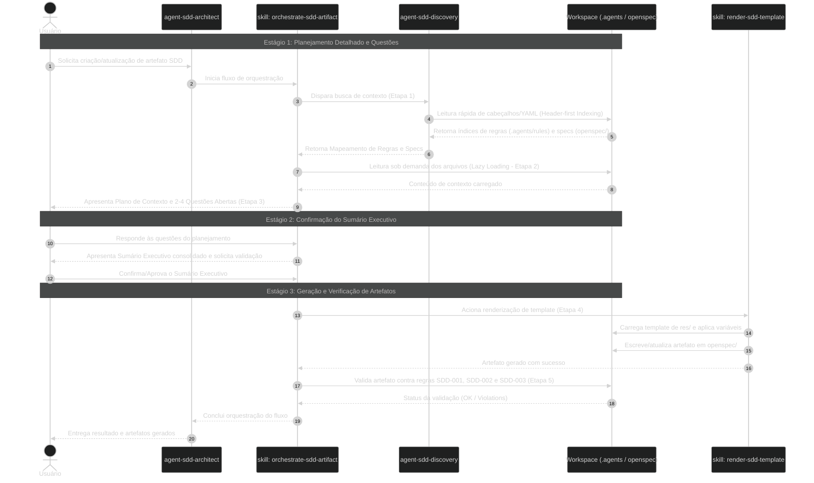

#  sdd-architect-plugin

A specialist AI Plugin for **Spec-Driven Development (SDD)** architecture, artifact scaffolding, and governance enforcement within the Antigravity ecosystem.

---

## Overview

`sdd-architect` governs the strict separation between **AI Agent Behaviors** (stored under `.agents/`) and **Product Specifications** (stored under `openspec/`). It automates the scaffolding, discovery, rendering, and verification of SDD artifacts while keeping context windows optimized through lazy loading and header-first indexing.

---

## Architecture & Taxonomy

The repository enforces a strict, unified workspace directory layout:

```text
.
├── .agents/                                # Behavior & AI Infrastructure
│   ├── agents/                             # Specialist AI subagents
│   ├── plugins/                            # Extensions & MCP configs
│   ├── rules/                              # Workspace rules and guardrails
│   ├── skills/                             # Executable workflows & skills
│   └── hooks.json                          # Global lifecycle hooks
│
└── openspec/                               # Product Specifications & Lifecycle
    ├── specs/                              # Living specifications (Source of Truth)
    ├── changes/                            # Active proposals and spec deltas
    └── archive/                            # Immutable historical records
```

### Core Rules Reference

* **`SDD-000-framework-governance`**: Taxonomy, template standards, automated scaffolding, and Git versioning rules.
* **`SDD-001-structure-and-conventions`**: Workspace directory tree, naming conventions, and file path rules.
* **`SDD-002-context-discovery`**: Guidelines for Lazy Loading, Header-first Indexing, and explicit `res/` asset pointers.
* **`SDD-003-openspec-lifecycle`**: OpenSpec 3-stage lifecycle (`specs/` $\rightarrow$ `changes/` $\rightarrow$ `archive/`).

---

## Interactive 3-Stage / 5-Step Workflow

When orchestrating or scaffolding any SDD artifact, `sdd-architect` follows a deterministic interaction protocol:

```text
STAGE 1: Detailed Planning & Open Questions (User Interaction)
 ├── Step 1: Discovery (Invoke agent-sdd-discovery to map rules and specs)
 ├── Step 2: Context Loading (Lazy read of files specified in the Context Plan)
 └── Step 3: Plan & Questions (Present path mappings and 2-4 open questions)
```

```text
STAGE 2: Executive Summary Confirmation (User Interaction)
 └── Consolidate responses, confirm parameters, and request user validation.
```

```text
STAGE 3: Artifact Generation & Verification (Execution)
  Step 4: Execute (Invoke render-sdd-template and apply artifact changes)
  Step 5: Verify (Validate against rules SDD-001, SDD-002, and SDD-003)
```

---

## Key Components

### Agents & Subagents

* **`agent-sdd-architect`**: Primary orchestrator for SDD architecture, artifact creation, and governance enforcement.
* **`agent-sdd-discovery`**: Lightweight discovery subagent responsible for scanning header/YAML frontmatter metadata without loading full file contexts into memory.

### Skills

* **`orchestrate-sdd-artifact`**: Interactively guides the creation and update of SDD artifacts across the 3 interaction stages.
* **`render-sdd-template`**: Deterministic utility skill that reads templates from `res/`, performs variable substitution, and renders formatted files.

---

## Sequence Diagram


## Installation & Usage

1. **Register Plugin**: Add `sdd-architect` to your Antigravity plugin workspace or target directory `.agents/plugins/sdd-architect`.
2. **Invoke Architect**: Prompt your Antigravity assistant:
3. **Follow the Flow**:
* Review the Context Plan and answer the directed questions (Stage 1).
* Validate the consolidated Executive Summary (Stage 2).
* Review and apply the generated artifact changes using your assistant's file capability or environment tools (Stage 3).